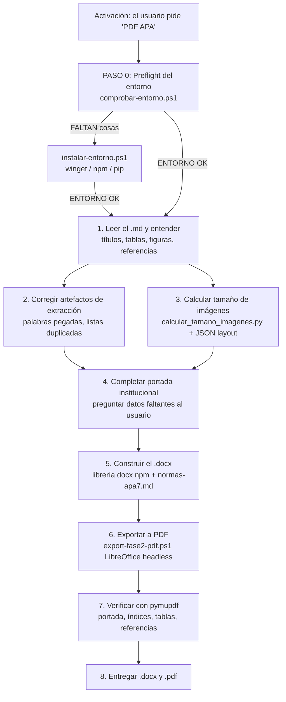

# Skill `generar-pdf-apa`

Genera un documento académico en **Word (.docx) y PDF** con las **Normas APA 7ª edición**, listo para entregar en Uniminuto: portada institucional, tabla de contenido, e índices de tablas/figuras con números de página reales, todo a partir de un Markdown `.md` ya convertido (MinerU/Docling).

> **Motor de exportación: LibreOffice (headless). No se requiere Microsoft Word.**

---

## Para qué sirve

La skill convierte el resultado de una conversión previa de PDF a Markdown (que puede arrastrar errores de extracción) en un trabajo académico **final, verificado y presentable**:

- **Portada institucional de Uniminuto** con layout en 3 zonas (título arriba, autores al centro, bloque institucional abajo) y logo opcional solo si lo aportas.
- **Tabla de contenido siempre** e **índice de tablas y figuras solo cuando existen**, con páginas reales vía campos `PAGEREF` que se actualizan al abrir el documento.
- **Corrección automática** de artefactos de la conversión: palabras pegadas (`EJERCICIO 2:Diferenciaciónentre Bugs yFlaws` → `EJERCICIO 2: Diferenciación entre Bugs y Flaws`), marcadores de lista duplicados (`• •`, `1. 1.`), numeración pegada (`ACTIVIDAD1:`), siempre respetando nombres propios y términos técnicos.
- **Referencias corregidas a APA 7**: orden alfabético, sangría francesa y cursivas donde corresponde, aunque el `.md` ya las traiga como lista.
- **Tablas amplias en hoja horizontal** puntual (permitido por APA 7) para matrices comparativas.
- **Verificación final con `pymupdf`** antes de entregar: portada, índices, leyendas, hojas horizontales y referencias.
- Se entregan **ambos archivos** (`.docx` y `.pdf`).

## Requisitos del sistema

| Herramienta | Para qué se usa | Cómo se consigue |
|---|---|---|
| PowerShell 5.1+ | ejecutar los scripts de la skill | incluido en Windows |
| Node.js LTS + npm | generar el `.docx` con la librería `docx` | `winget install OpenJS.NodeJS.LTS` |
| Librería `docx` (npm) | construir portada, TOC, índices y tablas | `npm install docx@9.7.1 --no-save` |
| Python 3 + `pymupdf` (venv de Docling) | verificar el PDF final | `pip install pymupdf` en el venv |
| LibreOffice | **único motor** de conversión `.docx → .pdf` (F2) | `winget install TheDocumentFoundation.LibreOffice` |
| Conexión a internet | descargas de winget / npm / pip | — |

La skill valida estas herramientas automáticamente antes de tocar el documento (**PASO 0 / preflight**). Si falta alguna, la instala sola; si algo no puede instalarse, **se detiene y avisa** sin transformar el documento.

## Instalación

1. **Instala la skill** copiando la carpeta `generar-pdf-apa/` al directorio de skills de tu agente de IA, por ejemplo:
   - `C:\Users\<tu-usuario>\.agents\skills\generar-pdf-apa` (directorio en el que debe quedar `SKILL.md`).
2. **El entorno se arma solo.** La primera vez que uses la skill se ejecuta el preflight:

   ```powershell
   powershell -ExecutionPolicy Bypass -File "...\generar-pdf-apa\scripts\comprobar-entorno.ps1"
   ```

   Si sale `FALTAN:`, ejecuta el instalador automático (winget/npm/pip) y re-verifica:

   ```powershell
   powershell -ExecutionPolicy Bypass -File "...\generar-pdf-apa\scripts\instalar-entorno.ps1"
   ```

   > No trates de instalar nada a mano ni transformes documentos con herramientas faltantes.

## Cómo se usa

La skill se **activa solo con una frase explícita** para un documento concreto: *"PDF APA"*, *"genera el PDF APA"*, *"documento APA"* o equivalente. No se activa por el simple hecho de que exista un `.md`.

### 1. Entrega los tres insumos (siempre juntos)

| # | Insumo | Para qué sirve |
|---|--------|----------------|
| 1 | El **`.md`** fuente | texto, encabezados, tablas en markdown, referencias y marcas de imagen `` |
| 2 | Las **imágenes** referenciadas | se insertan en el documento (carpeta `images/` o archivos sueltos) |
| 3 | Los **JSON de layout** (`*_content_list.json`, `*_content_list_v2.json`, `*_middle.json`, `*_model.json`) | tamaño y posición real de cada figura (bbox) |

> Regla de oro: si falta algo, la skill **te lo pide** antes de continuar. Nunca asume ni inventa contenido.

### 2. Responde solo lo que falta

De tu archivo saldrá casi todo. La skill te preguntará únicamente por los **datos que no aparezcan** en tus documentos: datos de portada (docente y su título/profesión, materia-NRC, fecha), logo (opcional, solo si lo aportas) y, ante la duda, si el documento realmente no tiene tablas o figuras.

### 3. Recibe los dos archivos

`.docx` y `.pdf` verificados página por página, listos para entregar.

## Cómo funciona por dentro

Pipeline de 3 etapas: **leer/entender → construir → exportar/verificar → entregar**.



Detalles ya resueltos de cada etapa:

- **Tamaño de imágenes sin estimar a ojo:** un script Python lee el `bbox` de cada figura en el JSON de layout, conserva su proporción real y acota el ancho al contenido útil (6.5 in en carta).
- **TOC funcional de verdad:** las entradas usan campos `PAGEREF` sobre *bookmarks*, así el número de página se recalcula al abrir el documento.
- **Tablas renderizables en LibreOffice:** ancho explícito (`width` + `columnWidths` + `layout: FIXED`) y bordes solo horizontales; sin esto, LibreOffice no las muestra (bug conocido).
- **Exportación limpia:** perfil aislado de LibreOffice por corrida y copia temporal; el mensaje `Could not find platform independent libraries <prefix>` por stderr es benigno y se ignora.

## Estructura del repositorio

```
generar-pdf-apa/
├── SKILL.md                          # definición de la skill (activación, flujo, reglas)
├── references/
│   ├── normas-apa7.md                # reglas de formato APA 7
│   ├── portada-institucional.md      # orden canónico de la portada de Uniminuto
│   ├── campos-word-toc.md            # TOC/índices funcionales y trampas de docx/LibreOffice
│   └── requisitos-sistema.md         # herramientas obligatorias, verificación e instalación
└── scripts/
    ├── comprobar-entorno.ps1         # preflight del entorno (PASO 0)
    ├── instalar-entorno.ps1          # autoinstalación de lo faltante
    ├── calcular_tamano_imagenes.py   # tamaño real de imágenes desde los JSON de layout
    ├── ejemplo-build.js              # generador de ejemplo completo (.docx)
    └── export-fase2-pdf.ps1          # exportación a PDF con LibreOffice (método F2)
```

## Limitaciones

- **Windows / PowerShell 5.1+** (los scripts están pensados para este entorno).
- Requiere los **JSON de layout** de la conversión previa (MinerU/Docling): no trabaja con cualquier PDF ni convierte directamente de PDF a Word.
- Formato **APA 7 carta con márgenes 1 in**, sin reglas institucionales adicionales.

---

*Skill `generar-pdf-apa` — documento académico APA 7 (.docx + PDF) sin depender de Microsoft Word.*